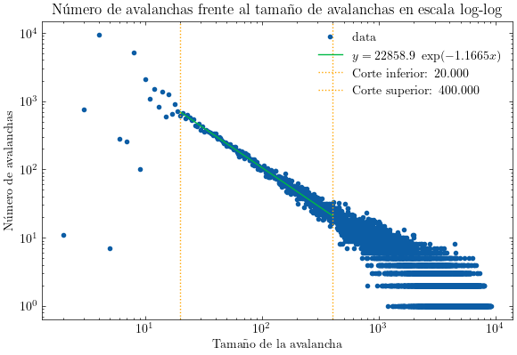

# Huellas de la Entropía en el Fenómeno de Criticalidad Autoorganizada

## 🔍 Descripción del Proyecto
Este repositorio contiene el desarrollo de mi Trabajo de Fin de Grado (TFG) titulado **"Huellas de la Entropía en el Fenómeno de Criticalidad Autoorganizada"**. En este estudio, se exploran las propiedades estadísticas y termodinámicas de sistemas de criticalidad autoorganizada (SOC), con un énfasis particular en la entropía y la dinámica de los grafos generados en estos sistemas.

## 📌 Objetivos Principales
- Analizar la evolución de la entropía en sistemas SOC.
- Estudiar la dinámica de grafos en modelos de pila de arena con conservación de energía.
- Explorar la conexión entre **SOC y redes neuronales**.
- Relacionar la estructura de los grafos con la ley de potencias observada en la distribución de avalanchas.

## 📊 Resultados Destacados
A lo largo del proyecto, se han obtenido diversas visualizaciones que ilustran la dinámica y estructura del sistema SOC. Algunas de las imágenes destacadas incluyen:

### 🔹 Grado vs Rango (Ley de Potencias)

- En este análisis se estudia la relación entre el grado de los nodos y su rango dentro de la red generada en el sistema SOC. Se ha encontrado que esta relación sigue una **ley de Zipf**, un comportamiento característico de muchos sistemas complejos, como la distribución de palabras en un texto o la conectividad en redes neuronales. Este resultado refuerza la idea de que los sistemas SOC pueden compartir propiedades con otros sistemas autoorganizados y plantea nuevas preguntas sobre su estructura subyacente.
- Se ha encontrado una ley de potencias con exponente aproximado de **-0.39**.

### 🔹 Evolución de la Dinámica del Grafo

- Representación de la estructura del grafo bidimensional en diferentes etapas del sistema.

### 🔹 Mapa de Superficie L×L en el Modelo OFC

- Se analiza la matriz de pesos como un sistema de ecuaciones lineales para estudiar el comportamiento crítico.

## 🚀 Futuras Extensiones
Este proyecto aún **no está finalizado**, y su desarrollo continuará con un enfoque en **machine learning y métodos de optimización relacionados con SOC**. Algunas de las próximas direcciones incluyen:

- **Uso de técnicas de aprendizaje profundo** para modelar y predecir patrones en la evolución del sistema.
- **Optimización de sistemas SOC** mediante métodos variacionales y redes neuronales.
- **Análisis de correlaciones temporales** en la dinámica de los grafos generados.

---
📌 *Este proyecto está en desarrollo y cualquier feedback o sugerencia es bienvenido.* 🎯

