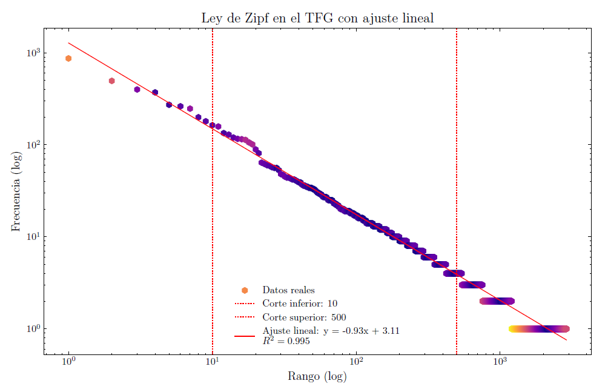
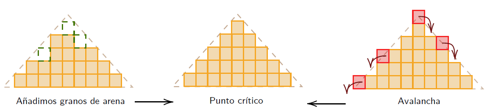
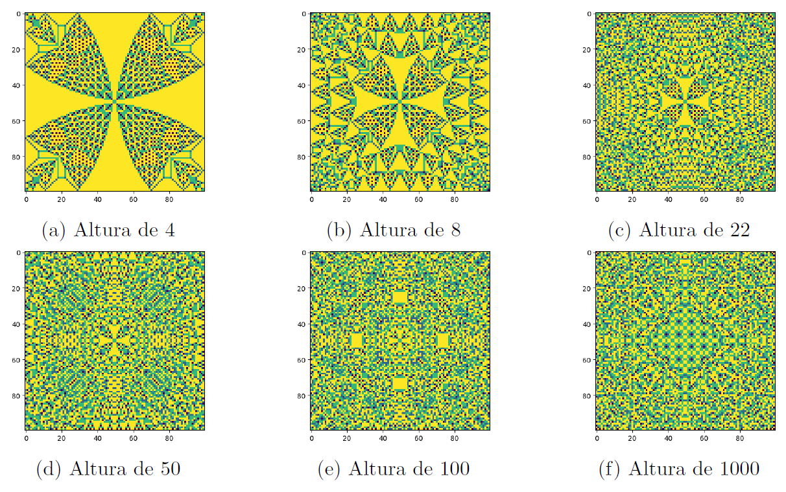
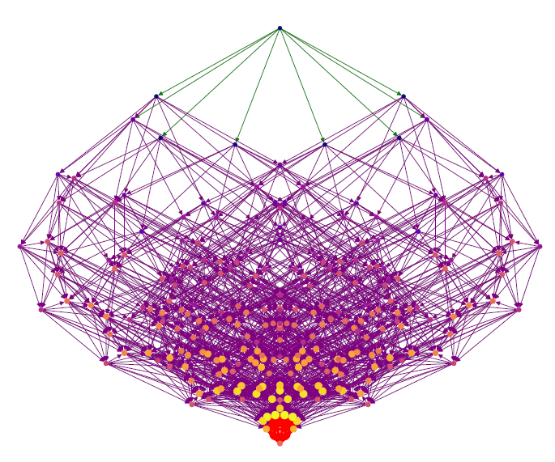
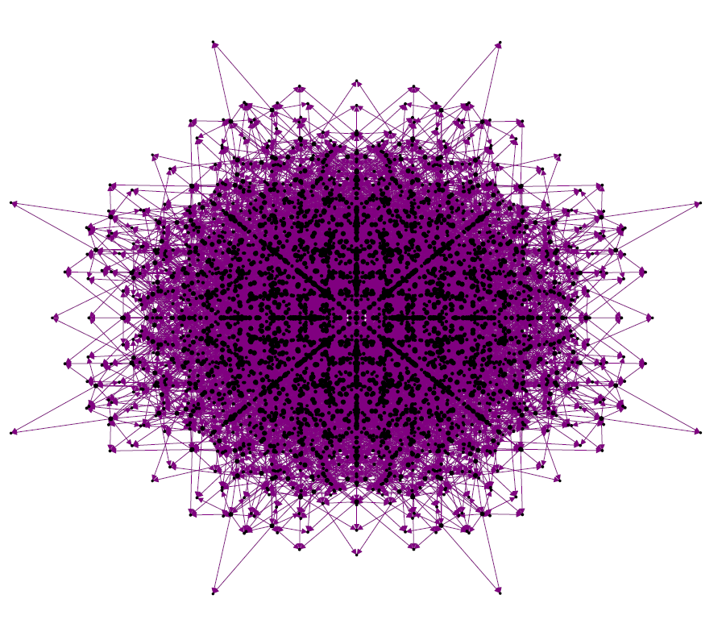

# 🧩 Huellas de la Entropía en el Fenómeno de Criticalidad Autoorganizada

## 🔍 Descripción del Proyecto  
Este repositorio contiene el desarrollo de mi Trabajo de Fin de Grado (TFG), titulado **"Huellas de la Entropía en el Fenómeno de Criticalidad Autoorganizada"**.  

El objetivo de este estudio es analizar las propiedades estadísticas y termodinámicas de sistemas de **criticalidad autoorganizada (SOC)**, con un enfoque en **entropía, dinámica de grafos y conexiones con redes neuronales**. Se han aplicado herramientas de **análisis de datos, simulación computacional y teoría de redes** para comprender la evolución de estos sistemas complejos.

## 📌 Objetivos Principales  
✅ **Análisis de la entropía en sistemas SOC**, explorando cómo evoluciona en el tiempo y su relación con la dinámica del sistema.  
✅ **Estudio de la estructura y evolución de grafos**, representando estados y transiciones en modelos de pila de arena con conservación de energía.  
✅ **Exploración de la conexión entre SOC y redes neuronales**, identificando patrones y estructuras que podrían aplicarse en modelos de aprendizaje automático.  
✅ **Identificación de leyes de potencia en la distribución de eventos**, caracterizando la autoorganización del sistema.  

## 📊 Resultados Destacados  

### 🔹 **Grado vs Rango (Ley de Potencias)**

  

- Se ha encontrado que los grafos generados siguen una **ley de potencia**, indicando una distribución sin escala en la estructura de conexiones.  
- Este comportamiento se observa en muchos sistemas complejos, como la **distribución de palabras en un texto, cráteres lunares o magnitudes de terremotos**.  
- La entropía de estos sistemas también exhibe patrones similares, sugiriendo una posible universalidad en la dinámica de SOC.  

### 🔹 **Modelo de la pila de arena y de OFC**
- Se ha implementado el **modelo de pila de arena de Bak-Tang-Wiesenfeld (BTW)**, donde la acumulación de granos lleva al sistema a un estado crítico con avalanchas de diferentes escalas.  
- Se han comparado simulaciones con el modelo **OFC (Olami-Feder-Christensen)**, analizando diferencias en la propagación de eventos.  

  

- Las simulaciones muestran **comportamiento fractal**, donde las avalanchas tienen estructuras autosimilares a diferentes escalas.  
- La distribución del tamaño de las avalanchas sigue una **ley de potencia**, confirmando que no hay una escala característica en el sistema.  

  

### 🔹 **Evolución de la Dinámica del Grafo**
- Se ha analizado la evolución de los grafos que representan estados del sistema SOC.  
- En **grafos unidimensionales**, se observan ciclos límite en la simulación, reflejando la dinámica recurrente del sistema.  

  

- En **grafos bidimensionales**, se han identificado estructuras más complejas y ricas en información, aunque más costosas computacionalmente.  

  

## 🚀 Futuras Extensiones  

Este proyecto aún **no está finalizado** y se continuará desarrollando con un enfoque en **machine learning y optimización de sistemas SOC**. Las siguientes líneas de trabajo están en curso:  

🔹 **Aplicación de redes neuronales** para modelar y predecir la evolución del sistema SOC.  
🔹 **Optimización de la dinámica de SOC** mediante métodos variacionales y algoritmos de aprendizaje automático.  
🔹 **Análisis de correlaciones temporales y redes complejas**, explorando estructuras emergentes en el sistema.  

---

📌 *Este proyecto sigue en desarrollo y cualquier feedback o sugerencia es bienvenido.* 🎯  

